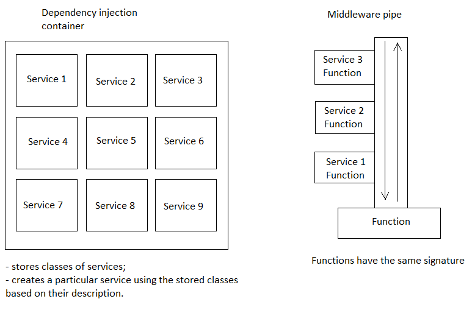

# creational 

## Factory method 

**Factory method** could be used to deal with the problem of creating objects without having to specify the exact class of the object that will be created. 


## Abstract factory 

The purpose of the **Abstract Factory** is to provide an interface for creating families of related objects, without specifying concrete classes.


The example above could be confused with another design patter - **factory method**, because this implementation could be considered as an extension of factory method. 
Plus if there's necessety to implement more specific logic while creating some of the products (when there's more than one methods specific for each of the products), this approach could violate Single-responsibility principle. 

But there is another implementation of abstract factory: 


In the example above, it seems like extending the interface `AbstractFactory` by classes `BankFactory` and `LoanFactory` could violate **Liskov substitution principle**. 
However this example allows you to be more flexible in terms of creating more specific products. 
And it's better to use factory method for creating banks and loans separately. 

I suppose that you can **abstract factory principle** in a little bit different context. 
For instance, if you assume that creating similar products (e.g. vihicle: truck, car etc) requires specific logic for each of the product, then **abstract factory** could be an excellent choice. 

And if you need some more specific logic for creating a car (e.g. if BMW, Audi, Lamborghini could be created in their own way), then you can use **abstract factory** one more time to create more specific products on a lower level. 

## Builder 

The intent of the **Builder design pattern** is to separate the construction of a complex object from its representation. By doing so, the same construction process can create different representations.


## Singleton

**Singleton pattern** is a software design pattern that restricts the instantiation of a class to a singular instance. 


## Protorype 

**Prototype** is used when the type of objects to create is determined by a prototypical instance, which is cloned to produce new objects. 


There's [C++ example](https://en.wikipedia.org/wiki/Prototype_pattern#Example) where concrete prototype has two types of constructors: 
1. for creating by external classes; 
2. for creating using `clone()` method. 

```C++
class Door : public MapSite {
public:
  Door(Room* r1 = nullptr, Room* r2 = nullptr)
    :room1(r1), room2(r2) {}
  Door(const Door& other)
    :room1(other.room1), room2(other.room2) {}
  virtual void enter() {}
  virtual Door* clone() const {
    return new Door(*this);
  }
  virtual void initialize(Room* r1, Room* r2) {
    room1 = r1;
    room2 = r2;
  }
  Door& operator=(const Door&) = delete;
private:
  Room* room1;
  Room* room2;
};
```

## Dependency injection 

### General description 

**Dependency injection** is a programming technique in which an object or function receives other objects or functions that it depends on. 

Dependency injection aims to separate the concerns of constructing objects and using them, leading to loosely coupled programs.
There are three main ways in which a client can receive injected services:
- **Constructor injection**, where dependencies are provided through a client's class constructor.
- **Setter injection**, where the client exposes a setter method which accepts the dependency.
- **Interface injection**, where the dependency's interface provides an injector method that will inject the dependency into any client passed to it.

In some frameworks, clients do not need to actively accept dependency injection at all. 
The lifetime of a dependency describes how long an object created by DI will be used by the system. In .NET Core, there are three primary lifetimes for dependencies: 
- **Transient** objects are always different; a new instance is provided to every controller and every service. Use this approach for the lightweight service with little or no state.
- **Scoped** objects are the same within a request, but different across different requests. This is a better option when you want to maintain a state within a request. 
- **Singleton** objects are the same for every object and every request.


How it is implemented in ASP.NET Core 

### Dependency resolver 

### Middleware pipe 


