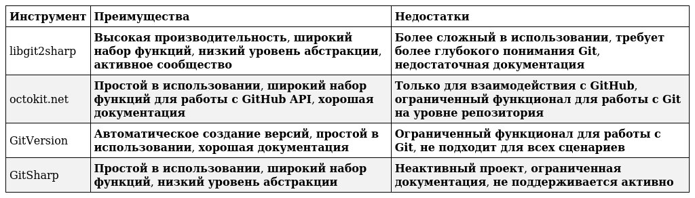

# Интеграции с C#

## План

### Критерии сравнения

- **Функциональность**: Какие операции Git поддерживаются?
- **Уровень абстракции**: Насколько легко использовать инструмент?
- **Производительность**: Насколько быстро работают операции Git?
- **Документация**: Качество и полнота документации.
- **Сообщество**: Размер и активность сообщества.
- **Поддержка**: Наличие поддержки и обновлений.
- **Лицензия**: Условия использования инструмента.

### Критерии завершения исследования

- **Понимание базовых операций Git**. Вы должны быть в состоянии выполнить основные операции с Git (clone, fetch, commit, push) с помощью каждого инструмента.
- **Сравнение инструментов по ключевым критериям**. Вы должны иметь четкое понимание того, чем отличается каждый инструмент и какие у него есть плюсы и минусы.
- **Выбор подходящего инструмента**. Вы должны выбрать инструмент, который наиболее подходит для вашего проекта.

### Основные сложности

- **Разные уровни абстракции**. Некоторые инструменты предоставляют более высокий уровень абстракции, что может быть проще для понимания, но менее гибким.
- **Управление состоянием**. Необходимо следить за состоянием репозитория и избегать ошибок при работе с Git.
- **Обработка ошибок**. Необходимо правильно обрабатывать ошибки Git, чтобы избежать сбоев в работе приложения.
- **Безопасность**. При работе с Git на уровне репозитория необходимо учитывать безопасность, чтобы предотвратить несанкционированный доступ к данным.

### План исследования

- **Определить цель**. Вам нужно взаимодействовать с Git на уровне репозитория (libgit2sharp, GitSharp) или с GitHub API (octokit.net)? 
- **Изучение базовой документации**.
- **Проверка примеров кода**: Большинство инструментов предоставляют примеры кода.
- **Выполнение базовых операций с Git**: Выполнить несколько базовых операций с Git (clone, fetch, merge, commit, push) с каждым инструментом.
- **Сравнение функциональности и производительности**.

## Исследование

### Преимущества и недостатки инструментов

### Основные ситуации использования

- **libgit2sharp**: идеален для сложных операций с Git на уровне репозитория, требующих высокой производительности.
- **octokit.net**: для работы с GitHub API, например, для создания pull requests, issues, и т.д.
- **GitVersion**: для автоматического создания версий проекта на основе Git-тегов.
- **GitSharp**: для простых операций с Git, но рекомендуется использовать libgit2sharp вместо GitSharp.

#### Рекомендации

- Начните с libgit2sharp, если вам требуется высокая производительность и широкий набор функций. 
- Используйте octokit.net, если вам нужно взаимодействовать с GitHub API.
- Используйте GitVersion, если вам нужна автоматизация создания версий.
