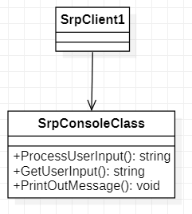
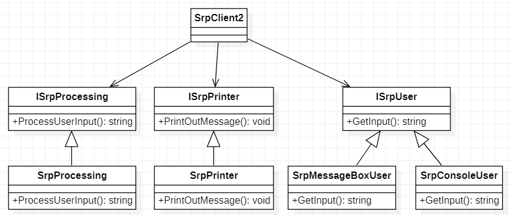
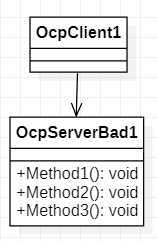
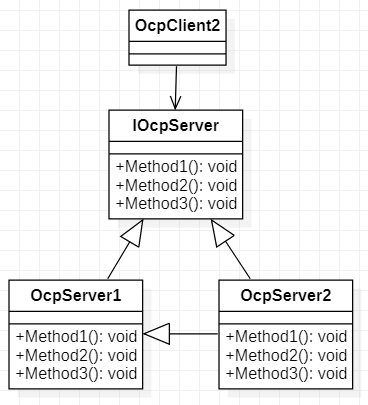
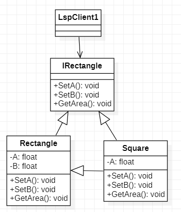
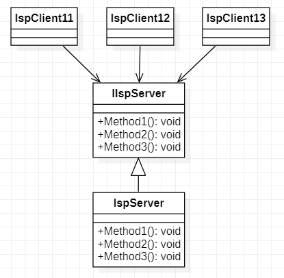
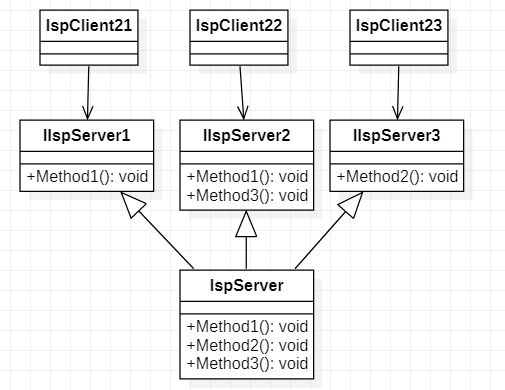
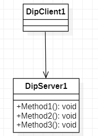
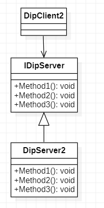

# SOLID 

SOLID is : 

- **Single-responsibility principle**: a class should have only one reason to change. 

Bad: 

Better: 

- **Open-closed principle**: a software entity should be open for extension but closed for modification. 

Bad: 

Better: 

- **Liskov substitution principle**: classes that use pointers or references to base class must be able to use objects of derived class without knowing it. 

Bad: 

- **Interface segregation principle**: classes should not be forced to depend upon interfaces that they don't use. 

Bad: 

Better: 

- **Dependency-inversion principle**: depend upon abstractions, but not concretions. 

Bad: 

Better: 

