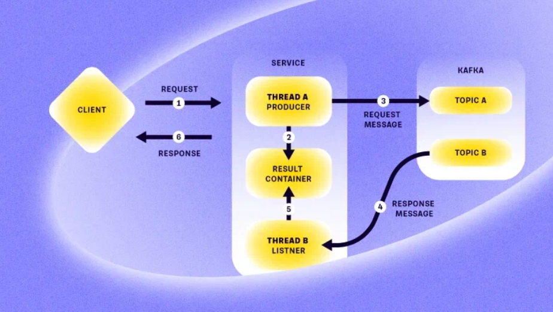

# MqInsideHttp

[English](README.md) | [Русский](README.ru.md)

This project allows testing ways to solve the problem of how to use asynchronous interaction (for example, with a message broker) inside a synchronous HTTP request.

For example, T-Bank faced a similar problem, and they described a way to solve it ([link to Habr](https://habr.com/ru/companies/tbank/articles/930666/)).

