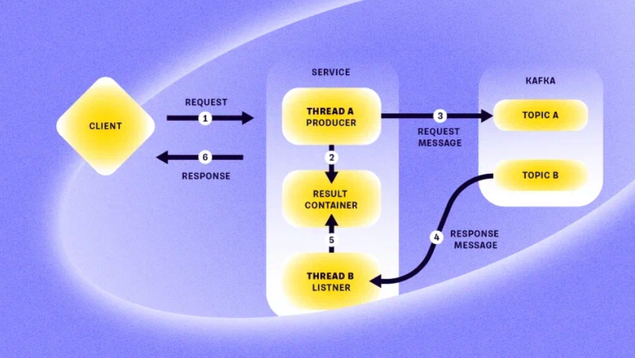

# MqInsideHttp

[English](README.md) | [Русский](README.ru.md)

Данный проект позволяет протестировать способы решения проблемы, как использовать асинхронное взаимодействие (например, с брокером сообщений) внутри синхронного HTTP-запроса.

Например, в компании Т-Банк возникла подобная проблема, и они описывали способ её решения ([ссылка на Хабр](https://habr.com/ru/companies/tbank/articles/930666/)).

## Обработка запроса в зависимости от используемого брокера сообщений

Например, мы имеем ограничение в виде уже существующей системы. И в рамках этой системы есть следующие особенности реализации:
- `Topic B` с результатом проверки был общим для всех внутренних систем компании. Процесс проверки условия асинхронный, то есть мы отправляли запрос в `Topic A`, а ответы с результатом проверки прилетали в `Topic B`.
- Необходимо фильтровать сообщения в `Topic B`, предназначенные только для нашего конкретного сервиса.
- Producer и consumer работают в разных потоках. Ответ от брокера сообщений в `Topic B` с результатом проверки может и не прийти, поэтому не стоит навечно зависать в ожидании ответа внутри пользовательского запроса.
- Приложение имеет больше одного инстанса: HTTP-запрос от клиента приходил на один из них, и отвечать нужно было там же.
- Брокер сообщений находится в зоне ответственности другой команды, поэтому для проверки того, что сообщение относится к нашему сервису, мы должны парсить тело сообщения.
- Для синхронизации сообщений теоретически можно использовать БД, чтобы избегать сложных межпотоковых взаимодействий. Однако это требует постоянного опроса БД о результате, что увеличивает нагрузку на БД, и поэтому стоит рассмотреть обработку сообщений в памяти приложения, а также очистку сообщений из памяти по окончанию обработки.

### Kafka

- Если используется Kafka, то ограничить, какие сервисы получат сообщение из `Topic B`, можно с использованием consumer group. Такой подход обеспечит нам свою очередь всех сообщений.
- Для фильтрации сообщений, предназначенных для конкретного сервиса, перед отправкой в `Topic A` генерируем уникальный идентификатор (`request_id`), который перекладывается в `Topic B` с результатом проверки.

### RabbitMQ

- Если используется RabbitMQ, то использовать consumer group мы не сможем, поэтому придется создавать отдельную очередь для каждого сервиса отдельно: `TopicB_ServiceA`, `TopicB_ServiceB`.
