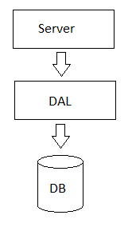

# SimpleWebService

[English](README.md) | [Русский](README.ru.md)

## Инициализация базы данных

1. Создать папку для хранения данных и локальную БД:
```
initdatafolder.cmd
```
2. Открыть БД:
```
opendbtest.cmd
```
3. Выполнить SQL-команды, находящиеся в файле [create.sql](sql/create.sql).

## Веб-сервер

Архитектура веб-сервера представлена ниже:


